# fadesort
_Fadesort_ is an implementation of a natural merge sort / stable quicksort hybrid sorting algorithm.

| stable? | best | average | worst | space |
|:-:|:-:|:-:|:-:|:-:|
| `yes` | `O(n)` | `O(n log n)` | `wip` | `Ω(√n)` |

### Agenda
- Test and optimize performance
- Add (up-to-date) visualization videos
- Translate recursive, binary-search based merge decisions into stack-based algorithm (e.g. *TimSort*, *PowerSort*)
- Assess benefits of "galloping merges"
    - Experiment with alternative methods to exploit run structure (preferably with minimal performance expense)
- Develop a fallback sorting algorithm (i.e. plain merge sort) for when quicksort degrades
    - Possibly avert this with a proper pivot selection algorithm
- Develop a more rigorous test suite for stability checking
- Unroll some loops

## Scanning
Fadesort scans a given array once to identify inputs that are already sorted in descending or non-descending order, called _runs_. Descending runs are reversed, and unsorted data is sorted with quicksort. After all runs are formatted (sorted in non-descending order), they are merged.

## Merging
Traditionally, merge sorts such as _TimSort_ use n / 2 elements worth of buffer space, merging two subarrays at a time by copying the smaller subarray into auxiliary memory. Fadesort can use an arbitrary (with a lower bound) amount of external memory. Fadesort also tries to reduce memory transfers via multi-way merging and (if necessary) rotate merges.

### Normal merges
The following diagrams illustrates normal merges for two runs, with arrows indicating merge direction.
1. **Merge up**\
    

2. **Merge down**\
    

3. **Merge out**\
    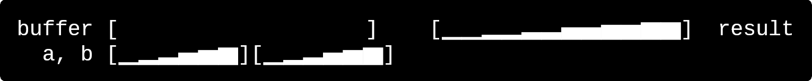

### Rotate merges

*Let `a` and `b` be two subarrays that we wish to merge.*\
Fadesort applies rotate merging by finding the maximum radius `r` for which all elements in the subarray `[a.right - r, a.right)` are greater than any element in `[b.left, b.left + r)` using a binary search. This is done so that we can rotate these two subarrays in a straightforward manner since `a.size() = b.size() = r`.

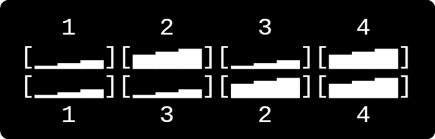

The left two subarrays and right two subarrays are then merged separately, giving us a fully merged run.

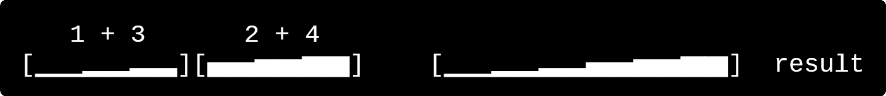

A small optimization that Fadesort makes for rotate merges is avoiding the rotation if the subarrays fit within the given buffer space (i.e. `r <= buffer.length`). In such a case, we can put one of the subarrays intended to be rotated into buffer space instead:

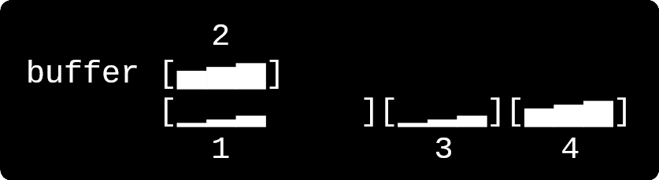

We can then apply *merge down* to `1` and `3`,

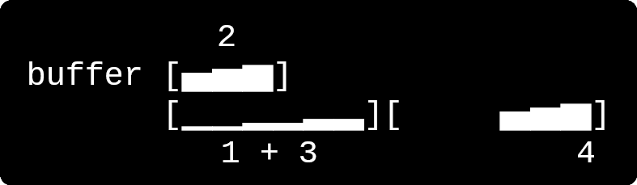

and *merge up* to `2` and `4`.

### Multi-way merges
Consider three subarrays we want to merge:

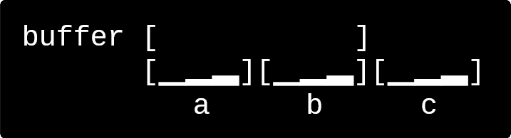

We could merge `a` and `b`, then merge `a + b` with `c`; however, this requires non-merging writes into the buffer. Instead, we can do the following -- merge `a` and `b` out into the buffer,

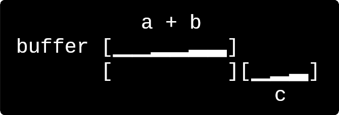

and then apply *merge up* with `a + b` and `c`.

We can also instead merge `b` and `c` out, and apply *merge down* with `a` and `b + c`.

Of course, we can extend this idea to 4 subarrays `a`, `b`, `c`, and `d`:
1. Merge out: `a, b in main -> a + b in buffer`
2. Merge out: `c, d in main -> c + d in buffer`
3. Merge out: `a + b, c + d in buffer -> result in main`

**Fadesort does not implement four-way merging.**

## Block quicksort
The assumption is made that the reader understands the principles of _stable quicksort_. Block quicksort is simply an extension of stable quicksort for an arbitrary buffer length within `1..n`. Fadesort uses all of the buffer space available and assigns the block size `w` to be `buffer.length`.

### Partitioning
*Let* `1` *represent an element that satisfies a predicate* `p(e)`*, and* `0` *otherwise.*\
Fadesort does a left-to-right partition, writing `1` elements into the buffer and `0` elements back into the main array. When the buffer is filled, we have created a full `1` block, so we copy it back into the main array. We may also have created some amount of `0` blocks -- a simple calculation determines the number of `0` blocks created, and the remainder is shifted to make space for the `1` block.

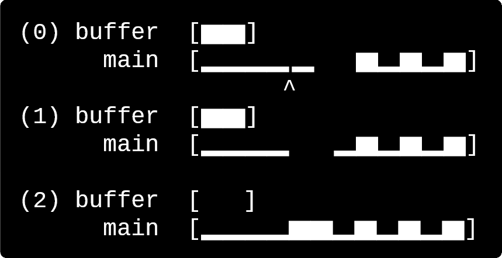

This is done until we have no elements left to partition; we may be left with an unfilled buffer,

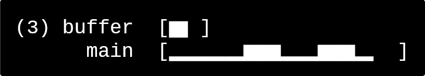

in which case we just copy it back to the end of the main array.

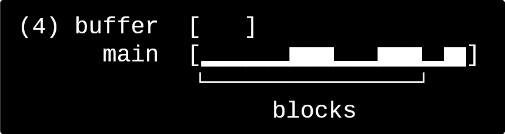

Notice that we have non-full `0` and `1` blocks at the end -- we will handle this later.

### Block sorting
We now have to arrange the partition i.e. put all `0` blocks to the left of the `1` blocks. Fadesort achieves this with a stable variant of *cycle sort* (which is commonly used) that sorts the blocks in linear time.

Fadesort uses a bit-array implementation with a prefix sum array to query cardinality up to a certain index; these are used to count `0` and `1` blocks. The block rearrangement tries to use less than 3 bits on average for every block. Because there are at most `floor(n / w)` blocks, sorting a partition requires `O(n / w)` space complexity -- as a result, the minimum space complexity for the overall quicksort algorithm is `Ω(√n)`.

Once sorted with cycle sort, our array looks like this:

To deal with the remainder blocks, we simply rotate the leftover `0` block to the end of the sorted `0` blocks. Notice how we do not need a fancy array rotation method: we know that the entire block fits into the given buffer space.

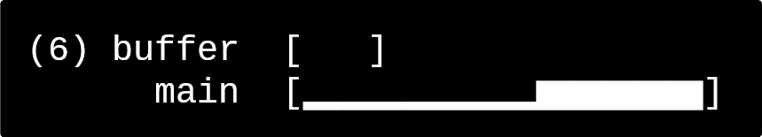

### Low cardinality inputs
Stable quicksort variants generally have `O(n log k)` t.c. where `k` is the number of comparatively distinct elements. Fadesort partitions first with `p(e) = e > pivot`. If no elements are written into the buffer (all elements are `0`), then we know that for all elements in our subarray `e`, `e <= pivot`. In this case, another partition is done with `p(e) = e >= pivot` which puts all elements `e >= pivot` on the right, but since `e >= pivot >= e` then `e == pivot`. Therefore, we do not need to sort the right side, which *avoids a significant amount of work when we have many similar elements*.

### Sufficient buffer space
If a partition is done but no `1` blocks are created, then all of our `1` elements are in the buffer. Thus, instead of copying that subarray into the main array and later partitioning it, we instead partition the buffer with `p(e) = e <= pivot` and put `0` blocks into the main array.

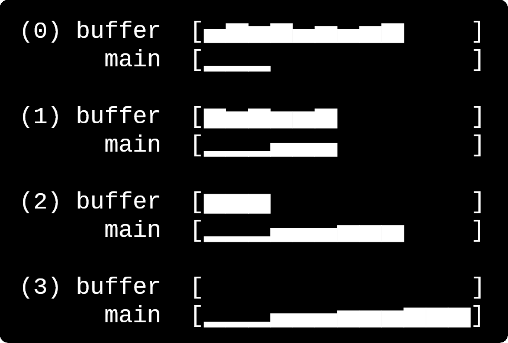
